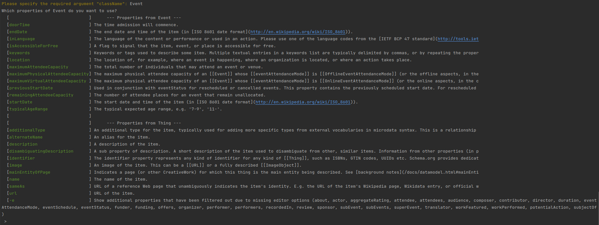

# Sitegeist.Pyranodis
## CLI kickstarter for Neos node types using schema.org

### Authors & Sponsors

* Bernhard Schmitt - schmitt@sitegeist.de

*The development and the public-releases of this package is generously sponsored
by our employer http://www.sitegeist.de.*

## Installation

Sitegeist.Pyranodis is available via packagist and can be installed with the command `composer require sitegeist/pyranodis`.

We use semantic-versioning so every breaking change will increase the major-version number.

## Usage

This package extends Sitegeist.Noderobis' (https://github.com/sitegeist/Sitegeist.Noderobis)
node type kicks-tarting capabilities by using the schema.org published language to suggest node types and properties.

### Command to create NodeTypes

```
./flow kickstart:nodetypefromschemaorg [<options>] <className>

ARGUMENTS:
  --className          A valid schema.org class name, e.g. "Event"

OPTIONS:
  --package-key        (optional) package, uses fallback from configuration
  --prefix             (optional) the node type prefix, e.g. "Document"
```

This command will start an interactive wizard to guide the user through the node type specification process,
based on the information provided by the schema.org API and already present node types.



### Specification refinement

The prepared specification can be refined using Noderobis' toolset,
please refer to the corresponding documentation at https://github.com/sitegeist/Sitegeist.Noderobis

## Contribution

We will gladly accept contributions. Please send us pull requests.
